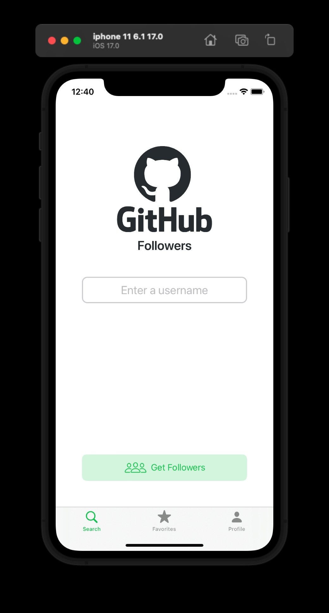
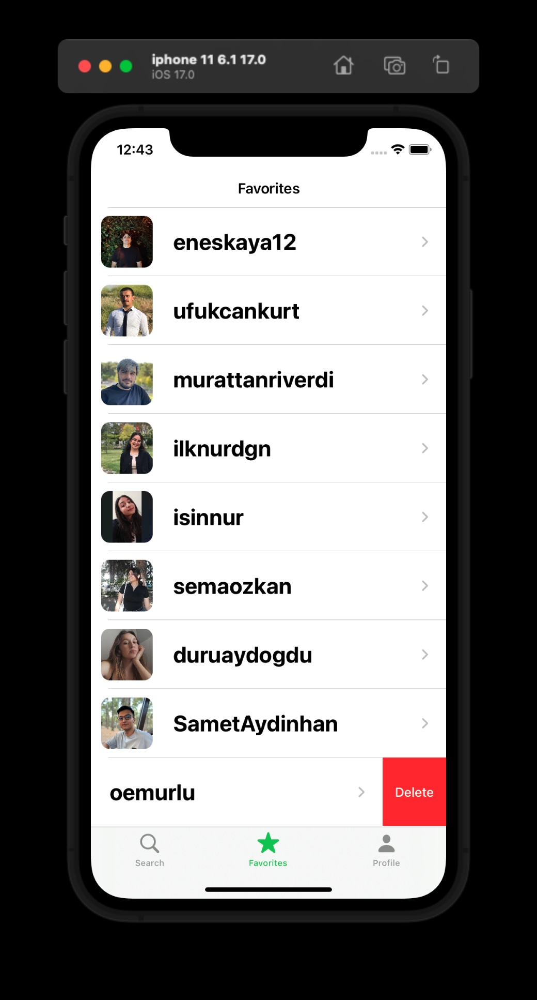
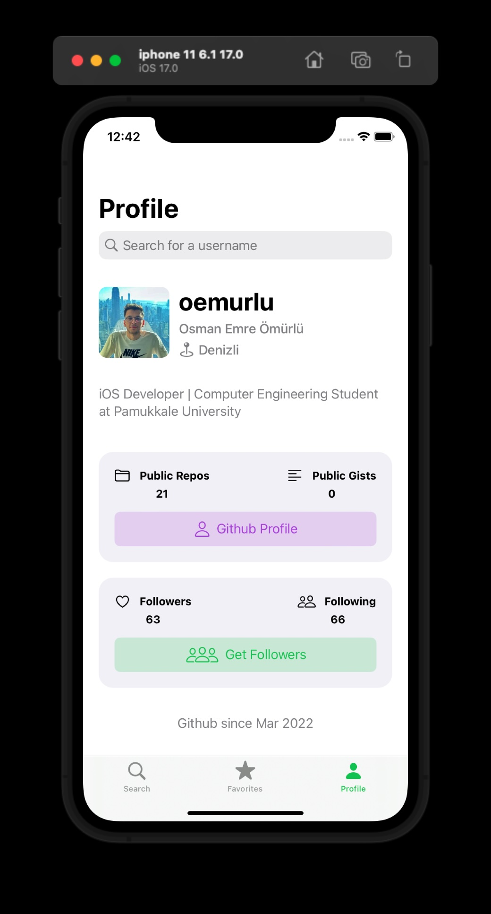
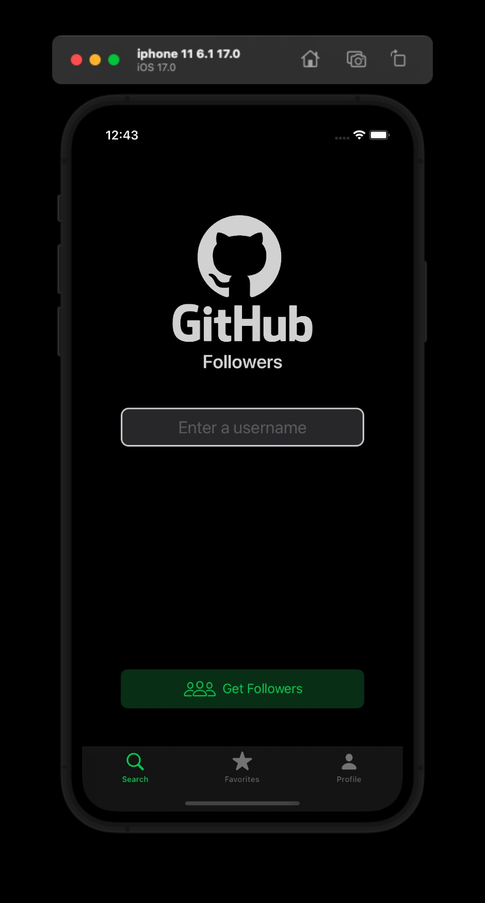
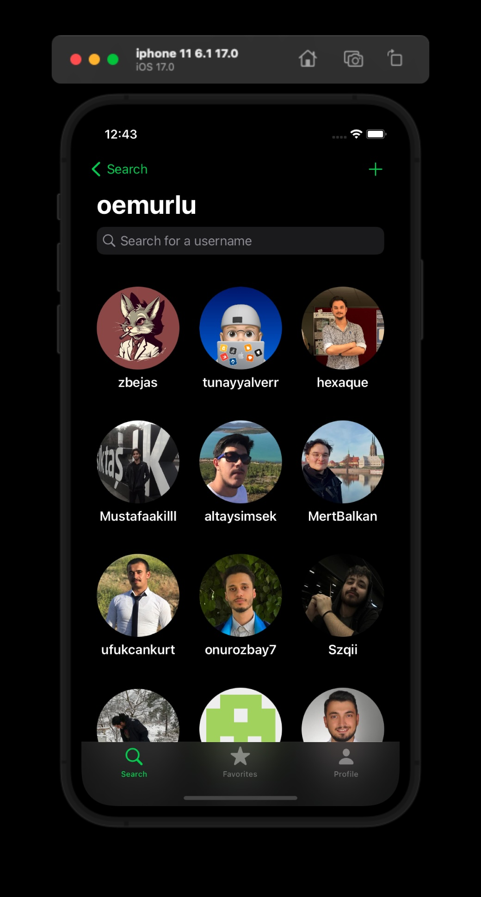
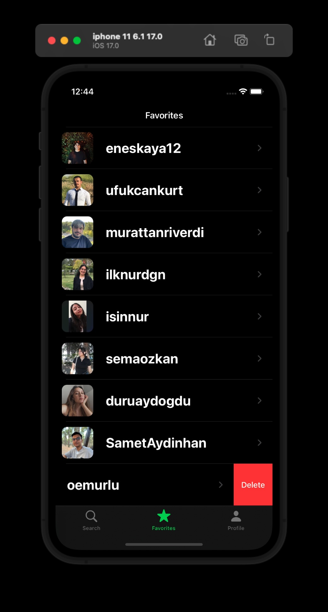
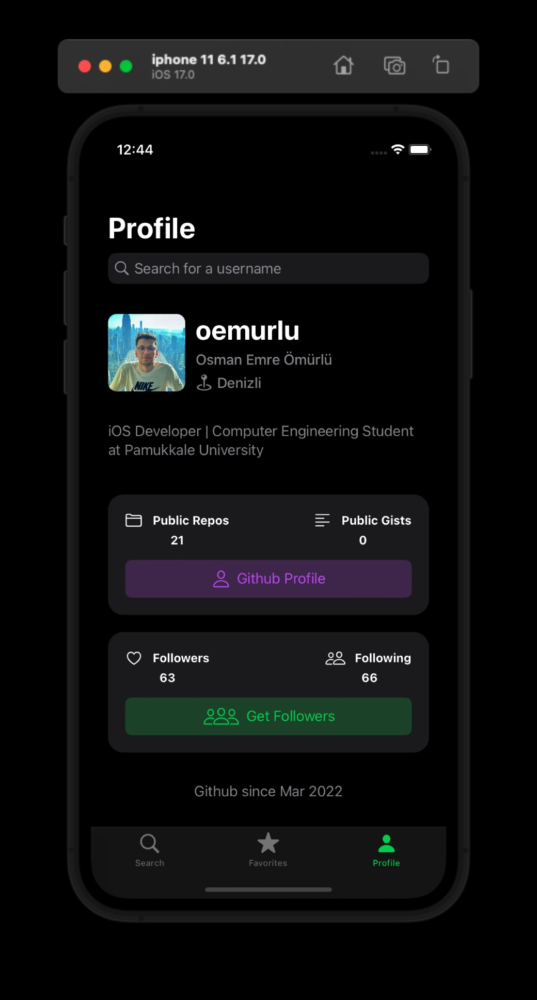

# GitHub-Followers-MVVM-UIKit
With this app, you can search to see the followers and infos of any Github user. After searching for a user, you can see the user's followers and go to the detail page of any selected follower. You can add multiple users to your favorites. You can see the details and screenshots below. This project is inspired by [Sean Allen](https://www.youtube.com/watch?v=JzngncpZLuw)'s course. Some improvements have been made in the current project.

## Tech Used
* Designed with MVVM pattern
* Programmatic UI with no storyboards
* Concurrency (async/await)
* API & Image Caching with NSCache
* CollectionView Diffable Datasource & Custom TableView
* No external dependencies
* Dark & Light mode support
* Custom Alert & Activity Indicator
* UIView animations
* Safari Services
* UserDefaults 
* Auto layout

## API
[GitHub API](https://docs.github.com/en/rest/users/users?apiVersion=2022-11-28)

## Screenshots

